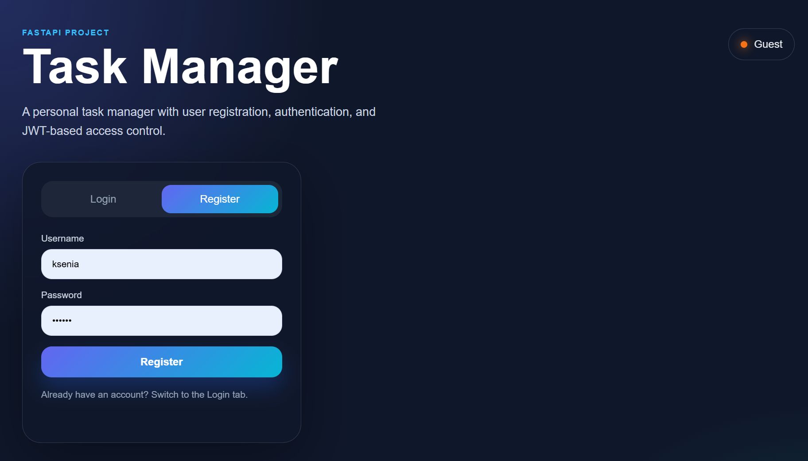
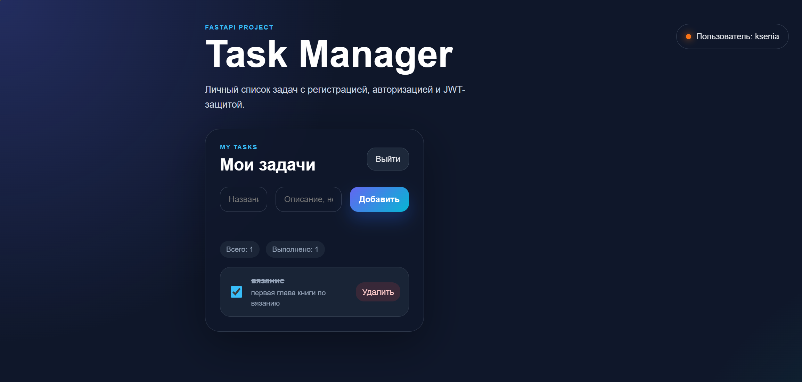
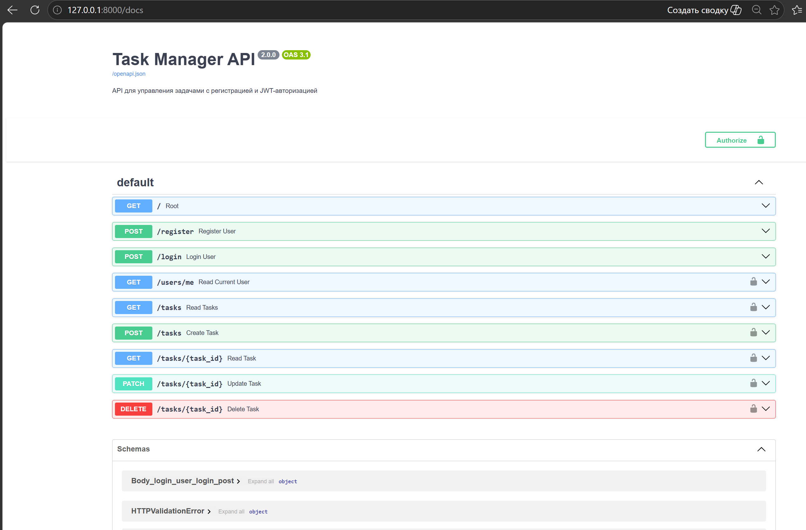

# Task Manager

**Task Manager** — это веб-приложение для управления личными задачами с регистрацией, авторизацией и JWT-защитой.

Проект реализован на **FastAPI** и показывает базовые навыки backend-разработки: работа с REST API, базой данных, пользователями, авторизацией, хешированием паролей и защищёнными маршрутами.

---

## Возможности проекта

- регистрация нового пользователя;
- вход пользователя в систему;
- JWT-авторизация;
- хеширование паролей;
- создание личных задач;
- просмотр списка своих задач;
- отметка задачи как выполненной;
- удаление задачи;
- защита задач от доступа других пользователей;
- Swagger-документация API;
- простой веб-интерфейс для работы с задачами.

---

## Стек технологий

- **Python**
- **FastAPI**
- **SQLAlchemy**
- **SQLite**
- **Pydantic**
- **JWT**
- **pwdlib / argon2**
- **Jinja2**
- **HTML**
- **CSS**
- **JavaScript**
- **Uvicorn**

---

## Скриншоты

### Главная страница



### Список задач



### Swagger-документация



---

## Структура проекта

```text
task-manager-api/
│
├── app/
│   ├── __init__.py
│   ├── main.py
│   ├── database.py
│   ├── models.py
│   ├── schemas.py
│   ├── crud.py
│   └── security.py
│
├── static/
│   ├── style.css
│   └── app.js
│
├── templates/
│   └── index.html
│
├── .gitignore
├── LICENSE
├── README.md
└── requirements.txt
```

---

## Установка и запуск

### 1. Клонировать репозиторий

```bash
git clone https://github.com/xenon54v/task-manager-api
```

### 2. Перейти в папку проекта

```bash
cd task-manager-api
```

### 3. Создать виртуальное окружение

```bash
python -m venv .venv
```

### 4. Активировать виртуальное окружение

Для Windows PowerShell:

```bash
.\.venv\Scripts\Activate.ps1
```

Для Windows CMD:

```bash
.venv\Scripts\activate
```

### 5. Установить зависимости

```bash
pip install -r requirements.txt
```

### 6. Запустить сервер

```bash
uvicorn app.main:app --reload
```

После запуска приложение будет доступно по адресу:

```text
http://127.0.0.1:8000
```

Swagger-документация API:

```text
http://127.0.0.1:8000/docs
```

---

## Основные API-эндпоинты

| Метод | URL | Описание |
|---|---|---|
| `POST` | `/register` | Регистрация пользователя |
| `POST` | `/login` | Вход пользователя и получение JWT-токена |
| `GET` | `/users/me` | Получение данных текущего пользователя |
| `GET` | `/tasks` | Получение списка задач пользователя |
| `POST` | `/tasks` | Создание новой задачи |
| `GET` | `/tasks/{task_id}` | Получение одной задачи |
| `PATCH` | `/tasks/{task_id}` | Обновление задачи |
| `DELETE` | `/tasks/{task_id}` | Удаление задачи |

---

## Авторизация

В проекте используется JWT-авторизация.

После входа пользователь получает access token.  
Этот токен используется для доступа к защищённым маршрутам:

```text
Authorization: Bearer <access_token>
```

Каждый пользователь видит и изменяет только свои задачи.

---

## Пример задачи

```json
{
  "title": "Изучить FastAPI",
  "description": "Сделать backend-проект для портфолио",
  "is_completed": false
}
```

---

## Что реализовано в проекте

В рамках проекта реализованы:

- модели пользователей и задач;
- связь между пользователем и его задачами;
- регистрация пользователя;
- проверка уникальности username;
- безопасное хеширование паролей;
- вход пользователя по username и password;
- генерация JWT-токена;
- проверка текущего пользователя по токену;
- CRUD-операции для задач;
- запрет доступа к чужим задачам;
- веб-интерфейс на HTML/CSS/JavaScript;
- подключение статических файлов и шаблонов;
- автоматическая Swagger-документация.

---

## Статус проекта

Проект находится в разработке.

Планируется добавить:

- Alembic-миграции;
- тесты на Pytest;
- Docker;
- фильтрацию задач;
- редактирование названия и описания задачи;
- деплой проекта.

---

## Автор

**Ksenia**

Junior Python Backend Developer

---

## License

This project is licensed under the MIT License.